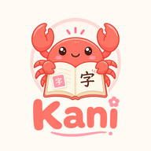

<p align="center">
  
</p>

<h1 align="center">Kani</h1>

<p align="center">
  <a href="https://github.com/bee-san/kanji_anki/releases">
    
  </a>
  <a href="https://github.com/bee-san/kanji_anki/actions/workflows/sonarqube.yml">
    
  </a>
  <a href="https://sonarcloud.io/summary/overall?id=bee-san_kanji_anki">
    
  </a>
</p>

Kani is an AnkiDroid companion app for Japanese learners who repeatedly miss the same kanji.

Kani helps you:
1. Find kanji that keep causing trouble in your AnkiDroid reviews.
2. Focus on why they are hard, such as unfamiliar characters or visually similar kanji.
3. Study them through a small, structured queue instead of another full SRS backlog.

# Features

## Flashcards
- FSRS scheduling for Kani study items.
- A progressive ladder that starts with easier prompts and moves toward harder kanji recall as you improve.

The study ladder can surface these prompt styles:
- Handwriting practice with stroke guidance.
- Typed meaning prompts.
- Recognition cards for kanji meanings.
- Font variation to help recognition across different typefaces.
- Word-to-reading prompts based on words imported from AnkiDroid.
- Similar-kanji practice when Kani has comparison data for a card.

You can enable, disable, and reorder ladder rungs in Settings. Study items move through the ladder according to review results, and `Study now` is the single entry point for practice.

Kani uses the Pareto principle: focus on the kanji most worth studying today instead of reviewing everything. By default, the suspended-kanji import focuses on Jiten ranks `100` through `3000`, and you can change that range in Settings.

The goal is to spend less time managing study queues and more time reading, listening, and immersing.

Other product areas:
* Suspended AnkiDroid cards are archived locally by default and imported through a dedicated suspended-kanji module.
* Jiten kanji frequency ranks are bundled offline for filtering.
* Manual sync reads AnkiDroid's exported flashcard provider; daily auto sync starts after the first successful manual sync.
* Releases are signed and published with APK and SHA-256 checksum artifacts.

## Product Contract

- Manual sync reads AnkiDroid's exported flashcard provider.
- Daily auto sync starts after the first successful manual sync and uses the same provider sync path.
- The expected note type is `Kiku`, with the `Mining` card template.
- Required fields are `Expression`, `ExpressionReading`, `MainDefinition`, `Sentence`, `Frequency`, and `FreqSort`.
- Suspended cards are archived locally and processed by the dedicated suspended-kanji import module.
- Jiten kanji frequency ranks are bundled in the offline dictionary DB for filtering. The default suspended import range is ranks `100` through `3000`, and it can be changed in Settings.
- Weak-kanji rows and details are derived from the active mirror plus the suspended archive.
- `Study now` is the single study entry point.
- Releases are signed, tagged as `vMAJOR.MINOR.PATCH`, and published with an APK plus SHA-256 checksum.

## Build

```bash
gradle :core:test :app:assembleDebug
```

Release builds require signing environment variables:

```bash
KANI_SIGNING_STORE_FILE=/path/to/release.jks
KANI_SIGNING_STORE_PASSWORD=...
KANI_SIGNING_KEY_ALIAS=...
KANI_SIGNING_KEY_PASSWORD=...
gradle :app:assembleRelease
```

## Release

Push a semver tag such as `v0.3.0`, or create/publish a GitHub Release with that tag name. GitHub Actions builds the signed APK, writes a matching `.sha256`, and publishes both files to the release.
