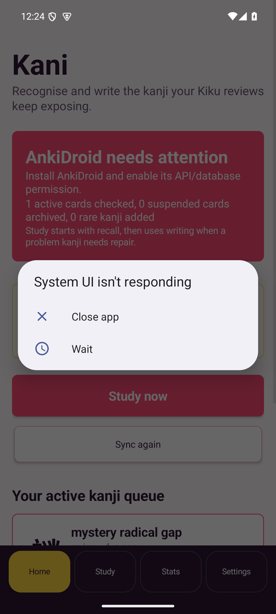
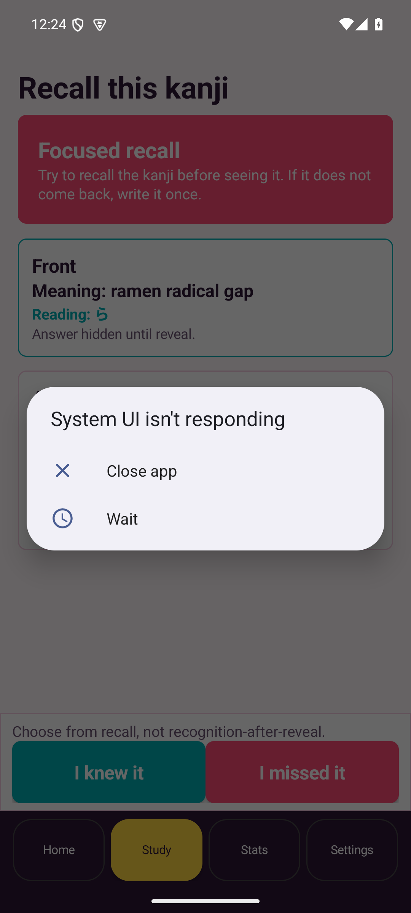

# Kani

Kani is a native Android companion for a single AnkiDroid collection. It finds
problem kanji inside your `Kiku` notes, keeps the evidence local, and gives
those kanji a focused writing-repair loop alongside AnkiDroid.

## Install

1. Install AnkiDroid.
2. Download the latest `kani-android-X.Y.Z.apk` from
   [GitHub Releases](https://github.com/bee-san/kanji_anki/releases).
3. Open the APK on your Android device and allow installs from that source.
4. Open Kani, grant the AnkiDroid provider permission, then tap
   `Sync AnkiDroid`.

Kani is sideloaded; it is not distributed through the Play Store.

## Screenshots

These screenshots were captured from the Android emulator used by the test
suite.

<p>
  
  
  
</p>

## What It Does

- Syncs `Kiku` notes and cards through AnkiDroid's flashcard provider.
- Archives suspended trouble cards locally and tags archived notes in AnkiDroid
  when the provider allows it.
- Builds a weak-kanji queue from real active and suspended examples.
- Shows a per-kanji recovery timeline: first import, support changes, reviews,
  retirements, and reopened repairs.
- Runs a small bridge SRS for focused recall and writing repair.
- Uses bundled Jiten rank data and stroke-order guides offline.
- Schedules one local background sync per day after the first successful manual
  sync.
- Checks GitHub Releases and can install a verified APK update with Android
  confirmation.

The runtime is Android-first. There is no Python server, fixture runtime, or
polling loop.

## Product Contract

- Manual sync reads AnkiDroid's exported flashcard provider.
- Daily auto sync starts after the first successful manual sync and uses the same provider sync path.
- The expected note type is `Kiku`, with the `Mining` card template.
- Required fields are `Expression`, `ExpressionReading`, `MainDefinition`, `Sentence`, `Frequency`, and `FreqSort`.
- Suspended cards are archived locally and processed by the dedicated suspended-kanji import module.
- The full Jiten kanji frequency CSV is bundled for offline filtering. The default suspended import cutoff is rank `3000`, and it can be changed in Settings.
- Weak-kanji rows and details are derived from the active mirror plus the suspended archive.
- `Study now` is the single study entry point.
- Releases are signed, tagged as `vMAJOR.MINOR.PATCH`, and published with an APK plus SHA-256 checksum.

## Build

```bash
gradle :core:test :app:assembleDebug
```

Release builds require signing environment variables:

```bash
KANI_SIGNING_STORE_FILE=/path/to/release.jks
KANI_SIGNING_STORE_PASSWORD=...
KANI_SIGNING_KEY_ALIAS=...
KANI_SIGNING_KEY_PASSWORD=...
gradle :app:assembleRelease
```

## Release

Push a semver tag such as `v0.3.0`. GitHub Actions builds the signed APK, writes a matching `.sha256`, and publishes both files to the release.
