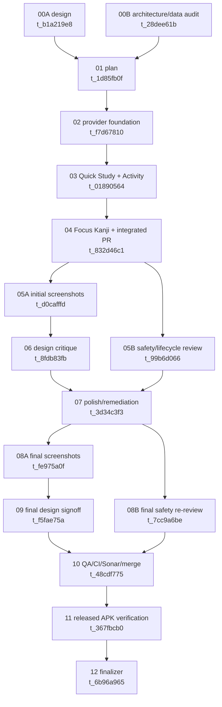

# Kani Multi-Widget Family Implementation Plan

> **For Hermes:** Use the `test-driven-development` and `requesting-code-review` skills while implementing this plan. Every coding child must continue `feat/multi-widget-family`; do not create a competing implementation branch or PR.

**Goal:** Ship four truthful, accessible Android widget-picker entries—Study Overview, Quick Study, Activity, and Focus Kanji—without replacing existing placed widgets or weakening Kani's local-data, refresh, privacy, or scheduling contracts.

**Architecture:** Preserve `KaniWidgetReceiver`, `KaniWidget`, `kani_widget_info.xml`, Glance state keys, and legacy `due_card`/`heatmap` values as the compatibility provider. Add three receiver/Glance pairs, focused snapshot loaders behind one non-creating local-store reader, and one tested registry/refresh receiver/alarm path shared by all four providers. Keep rendering stateless, load snapshots on `Dispatchers.IO`, and keep core selection/copy/layout decisions pure and test-first.

**Tech stack:** Kotlin, Android App Widgets, AndroidX Glance 1.1.1, Compose/Glance, Robolectric, Android instrumentation, SQLite `LocalStore`, Gradle, EN/JA Android resources.

---

## 1. Verified baseline and decision record

Re-verified on 2026-07-18 before creating this plan:

- Repository: `bee-san/kanji_anki`.
- `origin/main`: `c0c4297784c2059c71fadfdd4301b5e30842f426` (`v0.4.197`).
- GitHub's live `main` branch reports the same SHA.
- Open pull requests: none.
- PR #550 is merged; its merge commit is current `origin/main`. Its old head SHA is `15760a6ffc8b512fc0e33cfa0be4ef6d5c6812db` and is not the branch base. All work starts from the live merge commit, never from that stale/deleted head ref.
- PR #548 merged as `8da6bb6dc593368c983b17b8bcde17e501224adf`; no widget, manifest, provider XML, or widget-test files changed between that merge and current main.
- Existing focused baseline from the architecture audit: 50 widget tests in 11 suites passed.

The parent design and architecture audits disagreed in two places. This plan resolves them explicitly:

1. **Provider class names:** use the audited concise names `QuickStudyWidgetReceiver`, `ActivityWidgetReceiver`, and `FocusKanjiWidgetReceiver` (plus matching Glance classes), not the mock specification's `Kani...` alternatives.
2. **Focus selection:** use the architecture audit's local-day deterministic inventory policy. Due state may annotate the selected glyph, but must not influence which glyph is selected. This gives the design's truthful optional Due/Study affordance without changing the focus item after each review.
3. **Responsive geometry:** use the approved design specification's rendered tiers exactly. The architecture handoff's `110x72`/`110x130` table is provider-level shorthand, not a replacement for the approved Tiny/Compact/Regular/Wide variants. Target-cell metadata controls the recommended default while min/max resize bounds keep every approved tier reachable.
4. **Picker names:** use the approved concise labels and EN/JA descriptions in the table below. Do not add the architecture handoff's provisional `Kani:` prefix; the app name and icon already establish family ownership in the picker.

## 2. Non-negotiable invariants and non-goals

These are release blockers, not preferences:

1. Keep the exact component/class identities `dev.bee.kanjianki.widget.KaniWidgetReceiver` and `dev.bee.kanjianki.widget.KaniWidget`.
2. Keep `app/src/main/res/xml/kani_widget_info.xml`, `KaniWidgetConfigActivity`, `widget_style`, `widget_theme_override`, `due_card`, `heatmap`, and `follow_app` storage values.
3. Existing Due placements remain Study Overview. Existing Heatmap placements remain Activity-like legacy placements and continue opening Stats. Existing theme overrides survive update and reconfiguration.
4. A launcher render checks `context.getDatabasePath(LocalStoreSchema.DB_NAME).isFile` before constructing `LocalStore`. Missing, corrupt, and half-created databases return typed fallback states and never create/repair a database.
5. Every snapshot read runs off the main thread. No widget path calls AnkiDroid, network, sync, provider write-back, `DictionaryAssets.load`, `DictionaryStore.open`, or any API that installs/copies reference data.
6. Every due count or Due badge is derived from `ReminderEligibilityPolicy.eligibleReminderItems`; the widget must not advertise work Study rejects.
7. Focus displays only a normalized local glyph, its stored cleaned `primaryMeaning`, and its stored `readings` when nonblank. It never generates, translates, infers, or substitutes facts.
8. No sync button, headless sync, new periodic worker, exact-alarm permission, provider mutation, personal-data log, or fifth widget.
9. All four providers refresh through `KaniWidgetRegistry`; removing one provider must not cancel work required by another.
10. EN/JA live copy stays in `core/.../WidgetTextCopy.kt`; picker/loading/preview copy stays in localized resources and is tested against the same budgets.
11. Real launcher picker and placed-widget PNGs on API 26 and API 35 are mandatory. XML previews, Compose previews, mockups, and cropped app-only images are not acceptance evidence.
12. One implementation branch and one integrated PR only.

## 3. Provider and responsive contract

All providers set `android:updatePeriodMillis="3600000"`, `android:widgetCategory="home_screen"`, static localized loading content, unique `previewImage` and `previewLayout`, and bounded resize metadata. API 31+ uses target-cell/preview-layout metadata; API 26–30 uses min sizes and preview images.

| Picker entry | Receiver / Glance class | Provider XML | Target / resize contract | Fresh configuration |
|---|---|---|---|---|
| Study Overview | existing `KaniWidgetReceiver` / existing `KaniWidget` | existing `res/xml/kani_widget_info.xml` | Preserve exactly: min `250x72dp`, min-resize `180x72dp`, target `4x1`, responsive `250x72`, `250x130`, `340x130` | Existing optional config remains, but fresh instances expose theme only; no fresh Heatmap choice |
| Quick Study | `QuickStudyWidgetReceiver` / `QuickStudyWidget` | `res/xml/quick_study_widget_info.xml` | target `2x1`; min/min-resize `56x56dp`; max-resize `180x72dp`; horizontal resize; responsive `56x56`, `120x56`, `180x72` | none; follows app theme |
| Activity | `ActivityWidgetReceiver` / `ActivityWidget` | `res/xml/activity_widget_info.xml` | target `4x2`; min/min-resize `120x72dp`; max-resize `340x180dp`; horizontal + vertical resize; responsive `120x72`, `180x120`, `250x130` (larger bounds retain the wide composition without adding metrics) | none; follows app theme |
| Focus Kanji | `FocusKanjiWidgetReceiver` / `FocusKanjiWidget` | `res/xml/focus_kanji_widget_info.xml` | target `2x2`; min/min-resize `120x120dp`; max-resize `250x130dp`; horizontal resize; responsive `120x120`, `180x120`, `250x130` | none; follows app theme |

Provider labels and descriptions are resource-backed:

| Entry | EN name / description | JA name / description |
|---|---|---|
| Study Overview | `Study overview` / `Due reviews, streak, and what comes next.` | `学習概要` / `復習件数、連続学習、次の予定を表示します。` |
| Quick Study | `Quick study` / `See what is due and start in one tap.` | `クイック学習` / `復習件数を確認してワンタップで学習します。` |
| Activity | `Activity` / `Your streak and five weeks of review activity.` | `学習履歴` / `連続学習と5週間の復習履歴を表示します。` |
| Focus Kanji | `Focus kanji` / `One local kanji to remember next.` | `注目漢字` / `次に覚えたい漢字を1字表示します。` |

## 4. Exact production file and class map

### 4.1 Create

Under `app/src/main/kotlin/dev/bee/kanjianki/widget/`:

- `WidgetLocalStoreReader.kt`
  - `sealed interface WidgetStoreRead<out T>`: `Ready<T>`, `NotSetUp`, `Corrupt`.
  - `internal object WidgetLocalStoreReader` with a non-creating `read(context, block)` gate.
- `ActivityWidgetSnapshotLoader.kt`
  - `ActivityWidgetState`, `ActivityWidgetSnapshot`, `ActivityWidgetSnapshotLoader`.
- `FocusKanjiWidgetSnapshotLoader.kt`
  - `FocusKanjiWidgetState`, `FocusKanjiWidgetSnapshot`, `FocusKanjiWidgetSnapshotLoader`.
- `KaniWidgetRegistry.kt`
  - `KaniWidgetDescriptor` and immutable descriptors for all four receiver/widget pairs.
  - `installedDescriptors`, `refreshInstalled`, `descriptorForAppWidgetId`, and `hasInstalledWidgets`.
- `KaniWidgetRefreshReceiver.kt`
  - plain non-exported `BroadcastReceiver`; not a `GlanceAppWidgetReceiver`.
- `KaniFamilyWidgetReceiver.kt`
  - thin shared `GlanceAppWidgetReceiver` base that preserves `super` lifecycle handling and cancels the boundary alarm only after the last family provider is disabled.
- `QuickStudyWidget.kt` and `QuickStudyWidgetReceiver.kt`.
- `ActivityWidget.kt` and `ActivityWidgetReceiver.kt`.
- `FocusKanjiWidget.kt` and `FocusKanjiWidgetReceiver.kt`.

Under `core/src/main/kotlin/dev/bee/kanjianki/core/`:

- `FocusKanjiSelectionPolicy.kt`
  - `FocusKanjiSelection` data class.
  - pure `select(items, nowMillis, zoneId)` function.

Provider resources:

- `app/src/main/res/xml/quick_study_widget_info.xml`.
- `app/src/main/res/xml/activity_widget_info.xml`.
- `app/src/main/res/xml/focus_kanji_widget_info.xml`.
- `app/src/main/res/layout/{quick_study,activity,focus_kanji}_widget_loading.xml`.
- `app/src/main/res/layout/{quick_study,activity,focus_kanji}_widget_preview.xml`.
- `app/src/main/res/drawable/{quick_study,activity,focus_kanji}_widget_preview_image.xml`.
- `app/src/main/res/values/widget_preview_colors.xml` and `values-night/widget_preview_colors.xml` for semantic static preview/loading colors shared by all four entries.

### 4.2 Modify or move

- `app/src/main/kotlin/dev/bee/kanjianki/widget/KaniWidgetSnapshotLoader.kt`
  - `git mv` to `StudyWidgetSnapshotLoader.kt`; rename the loader to `StudyWidgetSnapshotLoader`, retain `KaniWidgetState`/`KaniWidgetSnapshot` for the compatibility provider, add explicit `ERROR`, and split Activity data out rather than retaining a combined god snapshot.
- `app/src/main/kotlin/dev/bee/kanjianki/widget/KaniWidget.kt`
  - preserve class identity; load instance preferences first; branch legacy Heatmap to the activity loader; otherwise load Study.
  - remove nested root/child click targets and render Home/Study as sibling regions where both exist.
- `KaniWidgetReceiver.kt`
  - extend `KaniFamilyWidgetReceiver`, retain `glanceAppWidget = KaniWidget()`, and never bypass normal `super` lifecycle.
- `KaniWidgetUpdater.kt`
  - `suspend fun refreshInstalled(context)` delegates to registry.
  - `fun requestUpdate(context)` sends an explicit broadcast to `KaniWidgetRefreshReceiver`.
- `KaniWidgetBoundaryAlarm.kt` and `KaniWidgetRefreshPolicy.kt`
  - one shared earliest boundary, persistent trigger bookkeeping, no `DATE_CHANGED` manifest dependency.
- `KaniWidgetConfigActivity.kt` and `KaniWidgetInstanceOptions.kt`
  - verify provider ownership, load saved options, preserve legacy Heatmap, and hide Heatmap for fresh placements.
- `KaniWidgetPalette.kt`
  - add `onPrimary`, `panelSoft`/`pill`, `borderSoft`, and accessible small-accent text roles; keep Autumn small text off raw 4.35:1 `primary`.
- `app/src/main/AndroidManifest.xml`
  - declare exactly four app-widget receivers and the dedicated refresh receiver.
- `app/src/main/res/xml/kani_widget_info.xml`
  - preserve component/config/size identity; update localized Study Overview description/preview only.
- Existing `kani_widget_loading.xml`, `kani_widget_preview.xml`, and `kani_widget_preview_image.xml`
  - preserve purpose; adopt shared day/night preview colors and Study Overview copy.
- `app/src/main/res/values/strings.xml` and `values-ja/strings.xml`.
- `core/src/main/kotlin/dev/bee/kanjianki/core/WidgetTextCopy.kt`.
- `MainActivityBase.kt` and `MainActivityStartup.kt` for the sanitized Focus detail extra.
- `MainActivitySettingsThemePanel.kt` to refresh after the theme write commits.
- `KaniApplication.kt` to refresh after a successfully applied staged restore, after the safe pre-component database swap.

No database schema or migration file changes are expected.

## 5. State and data contracts

### 5.1 Non-creating store gate

`WidgetLocalStoreReader.read` is the only widget entry to `LocalStore`:

```kotlin
sealed interface WidgetStoreRead<out T> {
    data class Ready<T>(val value: T) : WidgetStoreRead<T>
    data object NotSetUp : WidgetStoreRead<Nothing>
    data object Corrupt : WidgetStoreRead<Nothing>
}

internal object WidgetLocalStoreReader {
    fun <T> read(context: Context, block: (LocalStore) -> T): WidgetStoreRead<T> {
        val app = context.applicationContext
        if (!app.getDatabasePath(LocalStoreSchema.DB_NAME).isFile) {
            return WidgetStoreRead.NotSetUp
        }
        return try {
            LocalStore(app).use { WidgetStoreRead.Ready(block(it)) }
        } catch (error: Exception) {
            WidgetStoreRead.Corrupt
        }
    }
}
```

Do not log the exception or any glyph/count/history data from this path. Tests may assert the fallback type, never the user's content.

`NotSetUp` and `Corrupt` cannot truthfully read the persisted app theme. They use a day/night `ColorProvider` fallback—Girlypop roles in light UI mode and Dark roles in night UI mode—without opening settings or creating the database. A saved per-instance theme override on the compatibility provider still wins because Glance state is read before the store loader.

Every `provideGlance` calls its loader inside `withContext(ioDispatcher)` where the default is `Dispatchers.IO`. No loader launches detached work.

### 5.2 Study/Quick contract

`StudyWidgetSnapshotLoader` reads, in one local-store scope:

- `activeDashboardRows()`.
- `studyItems()` and ladder settings.
- `ReminderEligibilityPolicy.eligibleReminderItems(...)`.
- streak and `DailyStudyPlanPolicy` fields.
- theme choice.

It does not read 35-day Activity data. `KaniWidgetSnapshot` keeps current fields needed by Overview/Quick, adds `ERROR`, and keeps the exact due/new/lookahead semantics. Visual count caps at `999+`; semantics announce the exact local count.

State mapping:

- `NotSetUp` -> `NOT_SET_UP`, no numeric facts, Home/setup action.
- `Corrupt` -> `ERROR`, no stale values, Home/recovery action.
- ready with due > 0 -> `DUE_NOW`, Study action enabled.
- ready with due == 0 -> `NOTHING_DUE`, Home action only.

Quick Study consumes the same snapshot and never adds its own eligibility calculation.

### 5.3 Activity contract

`ActivityWidgetSnapshotLoader` reads only:

- `StudyStatsQueries(store).reviewDaySummaries(nowMillis, 35)`; the query already emits 35 chronological local-day buckets including zero days.
- `store.studyStreak(nowMillis)`.
- app theme.

`ActivityWidgetSnapshot` contains state, 35 daily totals, current streak, reviews today, 7-day total, 35-day total, and theme. It contains no due count and no Study action.

States: `NOT_SET_UP`, `ERROR`, `NO_HISTORY`, `HISTORY`. The whole live card opens Stats; setup/error states open Home.

Legacy `heatmap` Study Overview instances load this same Activity snapshot but retain their old layout/component/state and Stats destination.

### 5.4 Focus contract

`FocusKanjiSelectionPolicy` receives committed `RecordsImportModels.KanjiInventoryItem` rows and:

1. Normalizes with `TextUtil.normalizeSingleKanji`.
2. Requires `sourceCount > 0`, `suspended == false`, and nonblank cleaned `primaryMeaning`.
3. Keeps stored `readings` optional; blank means omit the reading line, not empty/fabricated fallback text.
4. Sorts by normalized glyph, then stored meaning/readings as deterministic duplicate tie-breakers; deduplicates by glyph.
5. Computes `localDate = Instant.ofEpochMilli(nowMillis).atZone(zoneId).toLocalDate()`.
6. Selects `floorMod(localDate.toEpochDay(), eligible.size)`.

The result is input-order independent and stable for the local calendar day, including year and DST boundaries. A committed sync may change the eligible inventory and thus the day's item; reviews do not rotate it.

`FocusKanjiWidgetSnapshotLoader` reads `store.allInventoryItems()`, theme, and the existing eligible study set. Selection uses inventory only. After selection, `isDueNow` is true only if the selected glyph appears in the `ReminderEligibilityPolicy` eligible set with `dueAtMillis <= nowMillis`; this annotation never changes selection order.

States:

- `NOT_SET_UP`: no glyph; setup copy; Home.
- `ERROR`: no glyph; recovery copy; Home.
- `EMPTY`: valid DB but no eligible local item; honest empty copy; Home/Browse.
- `READY`: exact selected glyph/meaning and optional exact reading; Details action. A wide tier may add a generic `Study now` sibling only when `isDueNow`; never label it as targeted study.

Forbidden: `DictionaryAssets.load`, `DictionaryStore.open`, bundled demo glyphs, translations, generated readings, network lookup, and selection from uncommitted/provider data.

## 6. Compatibility and configuration strategy

Android preserves a placed widget by receiver `ComponentName`; there is no safe automatic transfer to another provider. Therefore:

- Never rename/move `KaniWidgetReceiver`, `KaniWidget`, or `kani_widget_info.xml`.
- Never clear Glance preferences or change `STYLE_PREF_KEY`, `THEME_OVERRIDE_PREF_KEY`, `due_card`, `heatmap`, or `follow_app`.
- In `KaniWidget.provideGlance`, read the per-ID preferences before selecting a loader. `heatmap` loads/render Activity; every other/missing/unknown value loads/render Study Overview.
- `KaniWidgetConfigActivity` first checks `AppWidgetManager.getAppWidgetInfo(id)?.provider == ComponentName(this, KaniWidgetReceiver::class.java)`. Invalid, foreign, or deleted IDs finish with `RESULT_CANCELED` without reading/writing state.
- Reconfiguration loads current Glance state instead of starting from defaults.
- A saved Heatmap shows `Legacy activity layout` with explicit `Keep` or `Switch to Study overview`, plus the existing theme choice. Saving without an explicit switch preserves Heatmap.
- Fresh/default Study Overview placements omit the style section and offer theme only. Heatmap is not a fresh choice.
- Quick, Activity, and Focus omit `android:configure`, `widgetFeatures`, and Glance preference writes; they follow the app theme on API 26–35.
- Provider receivers always call the normal Glance superclass lifecycle. Do not bypass `onDeleted`; Glance must remove only the deleted ID's state.
- `KaniFamilyWidgetReceiver.onDisabled` calls `super` first and then synchronously asks the registry whether any family IDs remain; only the zero-family case cancels the shared boundary alarm. Provider receivers do not override `onReceive`.
- App data clear cannot be intercepted. The next platform update must replace stale RemoteViews with `NOT_SET_UP` without creating a DB.

Mandatory upgrade smoke:

1. Install the pre-change build and place one Due and one Heatmap `KaniWidgetReceiver`, each with a non-default theme override.
2. Record both appWidget IDs and state values.
3. Upgrade in place to the feature build.
4. Verify IDs/components unchanged; Due renders Study Overview, Heatmap renders legacy Activity, themes unchanged, and no re-add is required.
5. Reconfigure each and verify values load before save.
6. Add each new provider from the picker and verify no configuration activity launches.

## 7. Shared registry, refresh, and boundary lifecycle

`KaniWidgetRegistry` owns four immutable descriptors:

```kotlin
internal data class KaniWidgetDescriptor(
    val receiverClass: Class<out BroadcastReceiver>,
    val widgetFactory: () -> GlanceAppWidget,
    @XmlRes val providerInfoRes: Int,
)
```

Required behavior:

- `installedDescriptors(context)` prefilters each `ComponentName` with `AppWidgetManager.getAppWidgetIds`.
- `refreshInstalled(context)` calls each installed descriptor's unique widget `updateAll(context)` once; uninstalled descriptors are skipped.
- `descriptorForAppWidgetId(context, id)` resolves `getAppWidgetInfo(id)?.provider` only against the four known components.
- `hasInstalledWidgets(context)` is true if any descriptor has IDs.

`KaniWidgetUpdater.requestUpdate(context)` sends an explicit non-exported broadcast. `KaniWidgetRefreshReceiver`:

- is a plain `BroadcastReceiver`, calls `goAsync()`, launches the registry refresh on IO, and calls `PendingResult.finish()` in `finally` after the suspended refresh completes;
- handles the explicit refresh action and manifest-deliverable `TIME_SET`, `TIMEZONE_CHANGED`, `BOOT_COMPLETED`, `MY_PACKAGE_REPLACED`, and `LOCALE_CHANGED`;
- clears fired/stale boundary bookkeeping before refresh;
- does not declare `DATE_CHANGED`, which is not manifest-deliverable on supported API 26+.

Refresh sources, all through `KaniWidgetUpdater.requestUpdate`:

- persisted review (`MainActivityStudyReviewFlow.widgetRefresher`);
- study completion (`MainActivityStudyDoneActions`);
- committed manual sync (`ManualSyncEngine.widgetRefresher`, after transaction commit);
- reminder evaluation (`ReminderReceiverDailyActions`);
- completed theme save (`MainActivitySettingsThemePanel.onComplete`);
- successfully applied staged restore (`KaniApplication`, after the safe swap);
- time/zone/locale/boot/package events;
- hourly provider fallback;
- per-instance config save updates only the validated Glance ID.

One shared `KaniWidgetBoundaryAlarm` targets `KaniWidgetRefreshReceiver` with one fixed immutable `PendingIntent` and inexact `AlarmManager.RTC`:

- candidate A: `LocalDayPolicy.nextLocalDayStart(now)` whenever any family widget is installed;
- candidate B: Study's `nextUsefulAtMillis` only when future and within the hourly fallback window;
- persist the current trigger in private widget preferences;
- `considerEarlier` may replace the stored trigger only with an earlier valid candidate; a later provider render cannot postpone it;
- clear on fire and after time/timezone changes; an obsolete early wake is safe;
- cancel only when `KaniWidgetRegistry.hasInstalledWidgets` is false, never merely because one provider's `onDisabled` fired.

## 8. Deep-link contract

Reuse `kaniWidgetHomeIntent` and its `FLAG_ACTIVITY_CLEAR_TOP | FLAG_ACTIVITY_SINGLE_TOP` flags for every destination.

- Study Overview root -> Home; due sibling -> `EXTRA_OPEN_STUDY`.
- Quick due root/action -> `EXTRA_OPEN_STUDY`; all Glance-rendered non-due states -> Home.
- A Glance-rendered Quick non-due state opens Home. The platform-owned static `initialLayout` shown before Glance publishes actions is non-interactive and must show no fake count or Study affordance.
- Activity live card -> `EXTRA_OPEN_STATS`; unavailable states -> Home.
- Legacy Heatmap -> `EXTRA_OPEN_STATS`.
- Focus Details -> new string extra `MainActivityBase.EXTRA_OPEN_KANJI_DETAIL = "dev.bee.kanjianki.extra.OPEN_KANJI_DETAIL"` containing the literal glyph.
- Focus optional due sibling -> generic `EXTRA_OPEN_STUDY`.

`MainActivityStartup.handleLaunchIntent` treats the new exported-activity extra as untrusted:

1. Normalize with `TextUtil.normalizeSingleKanji` and reject empty/invalid/multi-glyph input.
2. Call `disableStudyOrdinaryResume()`.
3. Only on `MainActivityHome`, call the existing asynchronous `renderDetail(kanji, fromBrowse = true, browseQuery = "")`; otherwise fall back Home.
4. Invalid/missing input falls back Home without a dictionary install/query and without crashing.
5. Cover cold launch and `onNewIntent`; `MainActivityBase.onNewIntent` already replaces the intent before routing.

## 9. Copy, visual, accessibility, and resize rules

- Extend `WidgetTextCopy` rather than adding string literals to widget classes. Cover explicit error, empty, no-history, Details, Stats, count caps, concise tier variants, and complete content descriptions in EN/JA.
- Resource-only picker/loading/preview strings use names prefixed by provider and `preview_`; preview facts must never be reused as live fallback values.
- Static preview fixture: due `12`, streak `5`, due-later `3 by 18:00`, 7-day counts `[0,4,7,3,0,8,10]`, 35-day total `87`, Focus demo `学 / study / がく`. It exists only in static picker resources/tests.
- Preserve four grayscale-distinct silhouettes: text-led Overview, count/action-led Quick, grid-led Activity, glyph-led Focus.
- Use one calm rounded root card; no nested cards, decorative emoji, or live-looking skeleton facts.
- Independent targets are sibling regions, never clickable descendants of a clickable root. Each is at least `48x48dp`; dominant Study is preferably `56dp`.
- Tiny Quick is one root target. Compact Focus is one Details target. Activity heat cells are not focusable.
- Heatmap semantics are one summary with period total/streak/destination, not 35 TalkBack nodes. Today has an outline in addition to intensity.
- Use four discrete heat intensity roles, not arbitrary alpha alone. Programmatically test meaningful cell/today-outline contrast >= 3:1.
- Normal/action text contrast >= 4.5:1; large text/meaningful graphics >= 3:1. Test all ten themes. Raw Autumn `primary` on `bg` (4.35:1) is forbidden for small text; use `primaryText` or `ink`.
- At font scale >= 1.3, remove brand/tertiary lines first. At 2.0, keep hero plus state/action only. Never shrink support below 12sp or actions below 13sp.
- Headlines/actions do not ellipsize. Meaning truncates at a word/grapheme boundary. Reading is whole or omitted, never cut mid-kana.
- Visual counts cap at `999+`; TalkBack announces exact counts.

## 10. TDD and small-commit implementation order

Run the named focused test after each RED/GREEN cycle, then the broader widget/core surface before each commit. Do not batch these into one hidden commit.

On the current coding host, run Gradle from the repository root with the verified toolchain:

```bash
export JAVA_HOME=/opt/homebrew/opt/openjdk@17/libexec/openjdk.jdk/Contents/Home
export ANDROID_HOME=/opt/homebrew/share/android-commandlinetools
export ANDROID_SDK_ROOT="$ANDROID_HOME"
```

If a later worker runs on a different host, use that workspace's `AGENTS.md` SDK path instead; never add a machine-specific `local.properties` to the branch.

### Commit 1 — safe store boundary and split snapshots

**Tests first**

- Rename/split `KaniWidgetSnapshotLoaderTest.kt` into:
  - `StudyWidgetSnapshotLoaderTest.kt`.
  - `ActivityWidgetSnapshotLoaderTest.kt`.
  - `FocusKanjiWidgetSnapshotLoaderTest.kt`.
  - `WidgetLocalStoreReaderTest.kt`.
- RED cases: missing path remains absent; directory/invalid/half-created file returns typed fallback; corrupt read does not throw; Study due parity uses `ReminderEligibilityPolicy`; Activity emits exactly 35 local-day buckets; Focus reads only committed inventory and reports honest empty.

**Production**

- Add `WidgetLocalStoreReader` and the three focused loaders/contracts.
- Remove 35-day fields from Study's snapshot; route legacy Activity through the Activity loader.

**Commands**

```bash
./gradlew :app:testDebugUnitTest --tests 'dev.bee.kanjianki.widget.*SnapshotLoaderTest' --tests 'dev.bee.kanjianki.widget.WidgetLocalStoreReaderTest'
git add app/src/main/kotlin/dev/bee/kanjianki/widget app/src/test/kotlin/dev/bee/kanjianki/widget
git commit -m "refactor(widget): split safe local snapshots"
```

### Commit 2 — four-provider registry and durable refresh receiver

**Tests first**

- Extend `KaniWidgetProviderInfoTest`: exactly four `APPWIDGET_UPDATE` receivers; unique receiver classes/XML/labels/previews; canonical old receiver/XML/config/size attributes retained; new providers have no configure state.
- Create `KaniWidgetRegistryTest.kt`: all-and-only installed descriptors update, foreign ID rejected, known ID resolves, zero installed no-op.
- Rewrite `KaniWidgetReceiverTest.kt` around provider-super behavior and create `KaniWidgetRefreshReceiverTest.kt`; a delayed fake suspend refresh must prove the pending result is unfinished until completion and finished in failure paths.

**Production**

- Add descriptors, three receiver shells, provider XML/manifest declarations, plain refresh receiver, and updater fan-out.
- Remove custom `onReceive` from `KaniWidgetReceiver`.

**Commands**

```bash
./gradlew :app:testDebugUnitTest --tests 'dev.bee.kanjianki.widget.KaniWidgetProviderInfoTest' --tests 'dev.bee.kanjianki.widget.KaniWidgetRegistryTest' --tests 'dev.bee.kanjianki.widget.*ReceiverTest'
git add app/src/main/AndroidManifest.xml app/src/main/kotlin/dev/bee/kanjianki/widget app/src/main/res/xml app/src/test/kotlin/dev/bee/kanjianki/widget
git commit -m "feat(widget): register four-provider refresh family"
```

### Commit 3 — shared boundary lifecycle and event matrix

**Tests first**

- Extend `KaniWidgetRefreshPolicyTest` and `KaniWidgetBoundaryAlarmTest` for midnight versus due, later-candidate rejection, fire/reset, time/zone reset, one-provider removal, final-provider cancellation, and inexact RTC/no exact permission.
- Add focused event-hook tests for review, study completion, committed sync, reminder, completed theme write, and successful restore.

**Production**

- Retarget alarm to refresh receiver, persist earliest trigger, add midnight boundary, and wire theme/restore events.

**Commands**

```bash
./gradlew :app:testDebugUnitTest --tests 'dev.bee.kanjianki.widget.KaniWidgetRefreshPolicyTest' --tests 'dev.bee.kanjianki.widget.KaniWidgetBoundaryAlarmTest' --tests 'dev.bee.kanjianki.widget.KaniWidgetRefreshReceiverTest'
git add app/src/main/kotlin/dev/bee/kanjianki app/src/test/kotlin/dev/bee/kanjianki
git commit -m "fix(widget): make family refresh lifecycle durable"
```

### Commit 4 — placed-instance compatibility and config migration

**Tests first**

- Extend `KaniWidgetInstanceOptionsTest`, `KaniWidgetConfigActivityTest`, and `KaniWidgetConfigScreenComposeTest`.
- RED cases: saved Due/Heatmap/theme values round-trip; reconfigure loads saved values; fresh screen has no Heatmap choice; legacy Heatmap defaults to Keep; explicit switch changes only style; foreign/deleted appWidget IDs rejected; new providers create no state.

**Production**

- Add provider ownership check, asynchronous initial-state read, explicit legacy choice, and compatibility loader branch.

**Commands**

```bash
./gradlew :app:testDebugUnitTest --tests 'dev.bee.kanjianki.widget.KaniWidgetInstanceOptionsTest' --tests 'dev.bee.kanjianki.widget.KaniWidgetConfig*Test'
git add app/src/main/kotlin/dev/bee/kanjianki/widget app/src/test/kotlin/dev/bee/kanjianki/widget
git commit -m "fix(widget): preserve legacy placed instance options"
```

### Commit 5 — Quick Study

**Tests first**

- Create `QuickStudyWidgetTest.kt` for tier selection and due/caught-up/setup/error copy/action contracts.
- Extend launch tests: due -> Study; every non-due state -> Home; task-reuse flags always set; no stats/sync/provider extras.
- Add preview/loading resource assertions and EN/JA copy budgets.

**Production**

- Implement `QuickStudyWidget`; one target at 56x56, sibling count/action only when the host size safely allows it.

**Commands**

```bash
./gradlew :core:test --tests 'dev.bee.kanjianki.core.WidgetTextCopyTest'
./gradlew :app:testDebugUnitTest --tests 'dev.bee.kanjianki.widget.QuickStudyWidgetTest' --tests 'dev.bee.kanjianki.widget.KaniWidgetLaunchTest'
git add app/src/main core/src/main app/src/test core/src/test
git commit -m "feat(widget): add Quick Study picker entry"
```

### Commit 6 — Activity and legacy Heatmap bridge

**Tests first**

- Create `ActivityWidgetTest.kt`: 7/35-day tier selection, zero-history honest state, caught-up unchanged, no due/Study content, four intensity levels, today outline, one semantics summary.
- Extend legacy tests: stored Heatmap uses Activity data and Stats route while the old component/state remains intact.
- Extend palette contrast tests for every theme and discrete activity roles.

**Production**

- Implement `ActivityWidget`, shared activity rendering primitives, and legacy adapter in `KaniWidget` without a second combined snapshot.

**Commands**

```bash
./gradlew :app:testDebugUnitTest --tests 'dev.bee.kanjianki.widget.ActivityWidgetTest' --tests 'dev.bee.kanjianki.widget.KaniWidget*Test' --tests 'dev.bee.kanjianki.widget.KaniWidgetPaletteTest'
git add app/src/main app/src/test
git commit -m "feat(widget): add Activity picker entry"
```

### Commit 7 — deterministic Focus policy and sanitized detail route

**Tests first**

- Create `core/.../FocusKanjiSelectionPolicyTest.kt`: normalization, `sourceCount`, suspension, meaning requirement, optional reading, dedupe/ties, input-order independence, same-day stability, next-day rotation, negative epoch floor-mod, year/DST/zone behavior, exact stored text, empty set.
- Extend `MainActivityStartupTest.kt` and `KaniWidgetLaunchTest.kt`: valid literal, invalid/multi-glyph/blank fallback, cold/warm route, duplicate-activity flags, no dictionary/sync action.

**Production**

- Add pure selection policy, `EXTRA_OPEN_KANJI_DETAIL`, sanitized route, and Focus loader due annotation.

**Commands**

```bash
./gradlew :core:test --tests 'dev.bee.kanjianki.core.FocusKanjiSelectionPolicyTest' :app:testDebugUnitTest --tests 'dev.bee.kanjianki.MainActivityStartupTest' --tests 'dev.bee.kanjianki.widget.FocusKanjiWidgetSnapshotLoaderTest' --tests 'dev.bee.kanjianki.widget.KaniWidgetLaunchTest'
git add core/src app/src/main app/src/test
git commit -m "feat(widget): add truthful Focus Kanji contract"
```

### Commit 8 — Focus UI, all previews, EN/JA, and accessibility

**Tests first**

- Create `FocusKanjiWidgetTest.kt` and `KaniWidgetLayoutPolicyTest.kt` for compact/regular/wide content, whole-or-omitted reading, honest states, optional generic Study sibling, font scales 1.0/1.3/2.0, minimum target sizes, and no nested click graph.
- Extend `WidgetTextCopyTest`, `KaniWidgetCopyTest`, provider resource tests, and palette tests for EN/JA/error/empty/999+/content descriptions/contrast.

**Production**

- Implement Focus UI and all static loading/preview resources.
- Refactor Overview/Quick/Activity layouts to the same sibling-target, semantic-role, font-scale rules.

**Commands**

```bash
./gradlew :core:test --tests 'dev.bee.kanjianki.core.WidgetTextCopyTest' :app:testDebugUnitTest --tests 'dev.bee.kanjianki.widget.*WidgetTest' --tests 'dev.bee.kanjianki.widget.KaniWidgetProviderInfoTest' --tests 'dev.bee.kanjianki.widget.KaniWidgetPaletteTest'
git add core/src app/src/main app/src/test
git commit -m "feat(widget): finish Focus UI and family previews"
```

### Commit 9 — instrumentation, upgrade evidence tooling, and integrated PR

**Tests first / harness**

- Extend `KaniWidgetLaunchInstrumentedTest.kt` for cold and warm Study/Stats/Focus routes and package-manager discovery of four providers.
- Create `KaniWidgetScreenshotFixtureInstrumentedTest.kt` under `androidTest` to seed deterministic sanitized local data only for test capture.
- Create `ci/scripts/capture_kani_widget_screenshots.sh` and `screenshots/kani-widget-family/manifest.schema.json`; never add fixture/demo fallback to release rendering.

**Verification**

```bash
./gradlew :core:test
./gradlew :app:testDebugUnitTest --tests 'dev.bee.kanjianki.widget.*'
./gradlew :app:compileDebugAndroidTestJavaWithJavac
./gradlew ciFast
```

Then execute the upgrade smoke and screenshot matrix below on real launchers. Commit only scripts/tests/schema at this stage; generated acceptance PNGs/manifests may be a separate evidence commit on the same branch if repository convention accepts them.

```bash
git add app/src/androidTest ci/scripts screenshots/kani-widget-family
git commit -m "test(widget): add family integration and evidence gates"
```

Open exactly one PR from `feat/multi-widget-family` to `main` only after commits 1–9 are integrated. Do not open per-widget PRs.

## 11. Screenshot and interaction evidence matrix

Every PNG sidecar records: commit, API, device, launcher/version, launcher grid, locale, font scale, UI mode, app theme, exact `OPTION_APPWIDGET_MIN/MAX_WIDTH/HEIGHT`, fixture ID, provider component, appWidget ID, and capture command/operator. Do not crop away launcher cell boundaries or include user data.

### Core matrix — 18 mandatory real captures

| ID | API(s) | Surface and state | Required size/focus |
|---|---|---|---|
| `api{26,35}-picker-family-en.png` | 26, 35 | Real widget picker showing all four entries | Names, descriptions, distinct previews; API 26 image vs API 35 layout |
| `api{26,35}-overview-compact-due.png` | 26, 35 | Placed Study Overview due | `180x72dp`; no clipping; sibling Home/Study targets |
| `api{26,35}-overview-wide-due.png` | 26, 35 | Placed Study Overview due | `340x130dp`; split/lookahead/7-day strip |
| `api{26,35}-quick-tiny-due.png` | 26, 35 | Placed Quick due | `56x56dp`; exactly one unambiguous target |
| `api{26,35}-quick-compact-due.png` | 26, 35 | Placed Quick due | `120x56dp`; count and >=48dp action fit |
| `api{26,35}-activity-compact-history.png` | 26, 35 | Placed Activity | `120x72dp`; 7 cells/streak/total |
| `api{26,35}-activity-wide-history.png` | 26, 35 | Placed Activity | `250x130dp`; 5x7 grid and Stats purpose |
| `api{26,35}-focus-compact-due.png` | 26, 35 | Placed Focus | `120x120dp`; exact glyph/meaning/whole reading |
| `api{26,35}-focus-wide-due.png` | 26, 35 | Placed Focus | `250x130dp`; sibling Details/Study >=48dp |

Two APIs times nine rows = 18 PNGs.

### State captures

API 35 all-four target-size contact sheets:

- `api35-family-not-set-up-en-light.png`.
- `api35-family-loading-en-light.png` using actual initial layouts, no demo-looking values.
- `api35-family-error-en-light.png`.
- `api35-family-caught-up-en-light.png`.
- `api35-family-empty-history-focus-en-light.png`.

Repeat `not-set-up` and `caught-up` on API 26.

### Theme, locale, scale, and accessibility supplements

- API 35 expanded family: Girlypop light, Dark, System light, System dark, Autumn, Midnight arcade.
- Automated contrast tests cover all ten app themes even though screenshots sample six.
- API 35 compact family: JA 1.0, EN 1.3, JA 2.0 font scale.
- API 26 compact family: JA 1.3.
- TalkBack traversal notes/recording for every compact and wide entry: order, spoken label, destination, and unavailable-action absence.
- Grayscale picker contact sheet proving four silhouettes remain distinct.
- Upgrade pair: before/after PNG plus state manifest for the existing Due and Heatmap IDs/theme values.

### Tap acceptance paired with captures

- Overview body -> Home; due sibling -> Study; caught-up action -> Home; legacy Heatmap -> Stats.
- Quick due -> Study; Glance-rendered caught-up/setup/error -> Home/recovery. The static initial loading layout is non-interactive and shows no Study affordance.
- Activity -> Stats only when available; otherwise Home.
- Focus Details -> exact validated local detail; optional due sibling -> generic Study; invalid literal -> safe Home fallback.
- Back returns to the previous task with no duplicate `MainActivity` instance.

No design approval, final QA, or merge may proceed without the real picker and placed-widget PNGs plus sidecars.

## 12. One-branch / one-PR integration sequence

- Branch: `feat/multi-widget-family`, based on verified `origin/main` `c0c4297784c2059c71fadfdd4301b5e30842f426`.
- Task 02 continues this branch and lands commits 1–4.
- Task 03 fetches the same branch, verifies the handed-off SHA, and lands commits 5–6.
- Task 04 fetches the same branch, verifies the handed-off SHA, lands commits 7–9, and opens the single integrated PR.
- Screenshot, review, and polish tasks review or append to that same branch/PR as directed; they do not create competing feature PRs.
- At every handoff: push, compare local SHA with `git ls-remote origin refs/heads/feat/multi-widget-family`, and record exact SHA/tests.
- If `origin/main` moves, do not silently rebase a child. The active implementation owner integrates current main once on this branch, reruns the focused and `ciFast` gates, and records the new base.
- Stop rather than auto-resolve incoherent parent SHA/branch handoffs, risky red CI, privacy exposure, fabricated Focus data, secrets/signing, destructive data operations, or paid quota.

## 13. KANBAN_GRAPH

Board: `kani`  
Tenant: `kani-multi-widget-family-20260718`

- 00A design: `t_b1a219e8` (design)
- 00B architecture/data audit: `t_28dee61b` (coding)
- 01 plan: `t_1d85fb0f` <- 00A + 00B
- 02 provider foundation: `t_f7d67810` <- 01
- 03 Quick Study + Activity: `t_01890564` <- 02
- 04 Focus Kanji + integrated PR: `t_832d46c1` <- 03
- 05A initial picker/placement screenshots: `t_d0cafffd` <- 04
- 05B safety/lifecycle/migration review: `t_99b6d066` <- 04
- 06 design critique: `t_8fdb83fb` <- 05A
- 07 polish/remediation: `t_3d34c3f3` <- 06 + 05B
- 08A final screenshots: `t_fe975a0f` <- 07
- 08B final safety re-review: `t_7cc9a6be` <- 07
- 09 final design signoff: `t_f5fae75a` <- 08A
- 10 QA/CI/Sonar/merge: `t_48cdf775` <- 09 + 08B
- 11 released APK verification: `t_367fbcb0` <- 10
- 12 finalizer: `t_6b96a965` <- 11



Routine review-required gates, screenshot/design signoff, green CI fixes, safe merge, and ordinary branch continuation follow Bee's standing Kani authorization. Hard stops remain for secrets/auth, destructive data operations, paid quota, gateway restarts, signing credentials, incoherent handoffs, fabricated learning data, privacy exposure, and risky red CI.

## 14. Definition of done

Implementation is complete only when:

- four and only four picker providers are discoverable on API 26 and API 35;
- pre-upgrade Due and Heatmap IDs/state/theme survive in place;
- no launcher path creates/repairs a DB or touches network/provider/dictionary installation;
- Study/Quick due claims match `ReminderEligibilityPolicy` and all loaders are off main;
- Focus selection is deterministic/local/truthful with honest missing/error/empty states;
- every event source reaches every installed provider through the tested registry;
- EN/JA, contrast, font scale, semantics, resize, picker previews, and independent targets pass;
- the full required real screenshot/sidecar matrix exists;
- focused tests, `ciFast`, integrated PR CI, Sonar review, safety re-review, design signoff, upgrade smoke, and released-APK verification are green.
