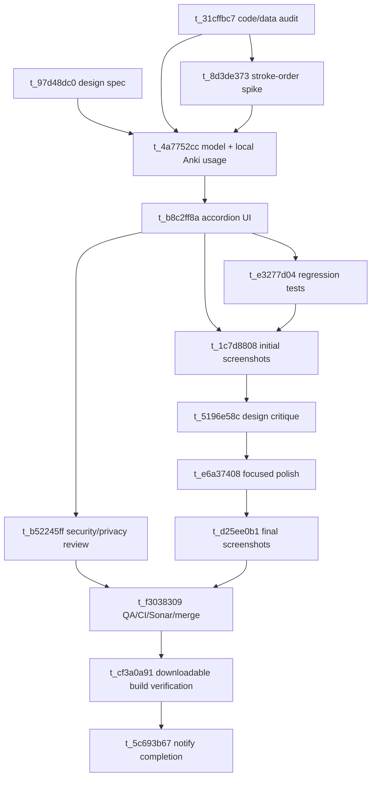

# Kani kanji-detail dropdowns on study answer cards

Date: 2026-06-17
Branch/worktree: `feature/kani-kanji-details-dropdowns-20260617` at `/Users/autumnskerritt/kanji_anki_worktrees/kani-kanji-details-dropdowns-20260617`
Board tenant: `kani-kanji-details-dropdowns-20260617`
Source screenshot: `Screenshot_20260617_073523_Kani.jpg`
Design owner: `design`
Status: UX spec ready for implementation

## User request

The study answer card has a large unused area after revealing an answer. Bee asked to use that space for expandable kanji details, especially:

- stroke order / stroke data,
- radicals / kanji breakdown,
- “used in Anki” rows showing each synced word/card where the kanji appears,
- deep links into the Anki/AnkiDroid card or note when possible.

This card is a design/spec task only. Do not implement app code here.

## Final UX direction

Add a compact, default-collapsed accordion stack inside the existing pink `StudyAnswerPanel`, directly below the current answer row and optional helper text. The answer row remains the primary interaction: users should be able to reveal an answer and immediately grade it without reading or scrolling through dictionary content.

The accordion should feel like a cute Kani “peek drawer,” not a dense dictionary wall:

- rounded pink/plum surfaces using existing Kani tokens,
- small crab/Kani-flavored microcopy where helpful,
- short rows and chips instead of long paragraphs,
- one expanded section at a time by default so the answer panel does not balloon unexpectedly.

## Layout contract

Current answer card structure:

1. Card title (`Answer` / `Reference`).
2. Large kanji glyph on the left.
3. Meaning/reading/source lines on the right.
4. Optional helper text.

New structure:

1. Existing title and answer row unchanged.
2. Optional helper text unchanged.
3. `Kanji details` accordion stack below a small top divider/spacer.

Do not move rating buttons (`Again`, `Good`, etc.) or bottom navigation into the panel. The default-collapsed accordion stack must fit in the blank pink answer-panel area shown in the source screenshot without pushing grading controls out of easy thumb reach on first answer reveal.

## Final accordion sections

### Section order and labels

Use these exact section names in this order:

1. `Details`
2. `Breakdown`
3. `Stroke order`
4. `Used in Anki`
5. `Why this card?`

Rationale:

- `Details` first because it answers the common “what is this kanji?” question with data already available in `dictionary-core`.
- `Breakdown` is shorter and friendlier than `Radical / breakdown`; the expanded body can still distinguish radical data from future component decomposition.
- `Stroke order` stays visible as an affordance, but must be honest if assets are not ready.
- `Used in Anki` is the most app-specific and likely the most useful deep-dive, but can have many rows, so it comes after quick metadata.
- `Why this card?` stays last because the existing `From: ...` cue already gives a lightweight answer in the main row.

### Default collapsed/expanded behavior

- All sections are collapsed by default on every answer reveal.
- Only one section is expanded at a time in MVP. Opening a section collapses the previously open section.
- Preserve expansion only while the same answer card remains visible. Reset to all-collapsed when moving to the next study item or after hiding/revealing another answer.
- Tapping the whole section header toggles expansion; do not require tapping a tiny chevron.
- Header rows must be at least 44dp tall. Target 48dp when space allows.
- The chevron rotates or swaps direction, but it is secondary to the full-row touch target.
- Keyboard/accessibility action should announce expanded/collapsed state.

### Collapsed row density

Collapsed accordion rows should be compact but finger-safe:

- Header height: 44-48dp.
- Horizontal padding: 12-14dp inside the panel.
- Vertical spacing between rows: 6dp.
- Title: 14-15sp bold/plum.
- Optional right-side summary: 12-13sp muted, single line, ellipsized.
- Chevron/icon: 20-24dp.

Collapsed stack copy examples:

- `Details` summary: `8 strokes • radical 手` or `Local dictionary`.
- `Breakdown` summary: `Radical + components` or `Radical only for now`.
- `Stroke order` summary: `8 strokes` or `Asset needed`.
- `Used in Anki` summary: `3 synced words` or `No synced words`.
- `Why this card?` summary: `From 抗議`.

## Expanded section specs

### 1. Details

Purpose: show offline dictionary metadata without making the answer row noisy.

Content order:

1. Meaning gloss chips or short comma-separated meaning line.
2. Reading chips grouped as `On`, `Kun`, and `Nanori` only when non-empty.
3. Metadata mini rows:
   - `Strokes`: stroke count.
   - `Grade`: school grade or `Not graded`.
   - `Radical`: radical number/name if available.
   - `Frequency`: KANJIDIC frequency if available.
   - `Jiten rank`: rank if available.

Density:

- Use two-column mini rows on wider phones, but collapse to one column at 360dp if labels or values would clip.
- Chips wrap naturally; no horizontal scrolling.
- Keep expanded `Details` body ideally under 180dp tall for common kanji.

Empty state:

- If no dictionary metadata is available, show: `Kani couldn't find local details for this kanji yet.`
- Include a small muted subline: `Review still works; this drawer can fill in after dictionary data syncs.`
- Do not show placeholder fake values.

### 2. Breakdown

Purpose: explain radical/component data while avoiding a false promise of full kanji etymology.

MVP content:

1. Radical row: number/name/stroke count when available.
2. Component decomposition area gated by data availability.

If component decomposition is not available:

- Show the radical row if known.
- Show empty/future copy: `Component breakdown is still molting. Radical data is shown for now.`
- Do not infer components heuristically from glyph shape.

If component decomposition becomes available later:

- Display components as small rounded chips with optional meanings.
- Keep chips wrap-only; no horizontal scroll.
- Do not use this section for long dictionary definitions.

Empty state:

- `No radical or component data yet.`

### 3. Stroke order

Purpose: surface stroke count now and create a safe path for future stroke-order visuals.

MVP decision:

If no licensed offline stroke-order asset exists, MVP may ship only with stroke count plus an honest unavailable state. This is acceptable. It is not acceptable to show a fake animation, hotlink remote diagrams during study, scrape unverified images, or imply stroke-order playback exists when it does not.

MVP content when assets are absent:

- `Stroke count: N` when available.
- Friendly unavailable copy: `Stroke-order animation needs a licensed offline asset before Kani can draw it here.`
- Optional action copy/disabled affordance: `Planned: animated guide`.
- Implementation must create/follow a separate card for licensed offline stroke-order assets if playback is requested.

Future content when assets are approved:

- Static first-frame SVG or compact animation preview.
- Play/pause/replay controls with 44dp touch targets.
- Step forward/back controls only if they do not crowd the card at 360dp.
- No network dependency during study.

Empty state:

- If even stroke count is unknown: `Stroke data is not available for this kanji yet.`

### 4. Used in Anki

Purpose: show local synced words/cards where the current kanji appears, with safe paths back to AnkiDroid where possible.

Data source:

- Use local synced data / cached indexes only.
- Do not query the AnkiDroid content provider synchronously on answer reveal.
- Rows should come from stable local snapshots such as `HistoricalNoteSnapshot` and card IDs captured during sync.

Row content:

Each visible row should include:

1. Expression/word, with the studied kanji visually emphasized if feasible.
2. Reading, single line, muted.
3. Meaning, single line or two lines max.
4. Optional tiny source/deck/model label only if it is short and non-noisy.

Row behavior:

- Row tap attempts to open the corresponding AnkiDroid card/note only if a supported, scoped intent/deep link is available.
- If opening is unsupported, AnkiDroid is missing, or required IDs are absent, row tap copies the note/card ID when available and shows a toast/snackbar: `Anki link unavailable — copied note ID.`
- Long-press may copy note/card metadata, but raw IDs should not be visually prominent by default.
- Never dump full raw note fields into the UI.

Ordering:

1. Exact source word for the current study card first.
2. Other local words containing the kanji, sorted by most recently synced/review-relevant if available.
3. Stable fallback sort by expression then note ID.

Truncation:

- Show up to 3 rows initially.
- If more exist, show a full-width `Show all N` / `Show fewer` row inside the expanded section.
- `Show all` expands within the same accordion body; it may make the page scroll, but must not create a nested scroll container.

Empty state:

- `No other synced Anki words yet.`
- Subline: `Sync more cards and Kani will connect them here.`

### 5. Why this card?

Purpose: explain the study cue in app language rather than dictionary language.

Content order:

1. `From: <source expression>` when available, matching the current answer-row cue.
2. Short reason sentence based on study task type, for example:
   - `Kani is asking this because 抗 appears in 抗議.`
   - `This rung practices recognizing the kanji from its meaning.`
3. Optional `Also appears in...` preview of up to 2 other local Anki expressions, if available.

Empty state:

- If the source expression is absent: `This card came from your synced study queue.`
- If no other examples exist: do not show `Also appears in...`.

## Narrow-phone constraints

The source screenshot shows a narrow phone layout with meaningful blank space inside the pink answer panel but limited horizontal room. Treat 360dp width as a hard design target.

Requirements:

- No text, chips, chevrons, or row actions may clip at 360dp width.
- No horizontal scrolling in any section.
- The glyph/answer row must keep its current readable hierarchy. The accordion must be below it, not squeezed beside it.
- At 360dp, expanded bodies use one-column layouts.
- Header summaries must ellipsize before pushing chevrons/actions off-screen.
- `Used in Anki` rows may use two text lines for meaning but should avoid three-line default rows unless the user taps `Show all`.
- The default-collapsed stack plus rating controls must be reachable without first scrolling on the screenshot's phone class.
- Expanded content may increase page height and use the existing page scroll, but implementation must avoid nested scrolling inside the accordion body.

## Visual style

Use current Kani visual language:

- Panel fill: existing pink panel token.
- Text: plum for titles/important labels; muted token for summaries and subcopy.
- Borders: existing Kani border token at 1dp.
- Shapes: rounded rectangles, 14-18dp for accordion rows; panel retains 22dp outer radius.
- Cute microcopy is allowed in empty states, but keep it short and not jokey enough to distract during review.

Recommended visual pattern:

- Collapsed header rows: slightly lighter/darker pink surface than the parent panel, with a thin border.
- Expanded body: same grouped surface as header or a connected card under it.
- Chips: small rounded pills, not high-contrast badges.
- Avoid dense tables, dictionary abbreviations without labels, or full-width raw JSON/field dumps.

## Performance and data-loading contract

- Answer reveal must not wait on dictionary lookup, AnkiDroid provider calls, or expensive local scans.
- Build detail models before or alongside the answer model from already-local/cached data.
- If data is still loading, show collapsed rows with conservative summaries and fill expanded content when ready.
- Expansion should feel instant on representative local data.
- Missing data should render empty states, not spinners that block grading.
- No secrets, raw note field dumps, or unexpected PII in logs/artifacts.

## Deep-link / AnkiDroid safety

Implementation must audit AnkiDroid opening behavior before enabling row taps:

- Prefer explicit, scoped intents to AnkiDroid package/activity if supported.
- Guard all launches with availability checks and exception handling.
- If unsupported, fall back to copy/toast behavior.
- Do not launch arbitrary external URLs from synced card data.
- Do not make provider calls during answer reveal just to discover row actions.

## Must-fix visual risks for implementation/UI testing

These are release blockers for this feature:

- Accordion default-collapsed state pushes `Again`/`Good` or bottom navigation out of thumb reach on first reveal.
- Any clipping at 360dp width, especially section labels, chevrons, `Show all`, or Anki row text.
- Nested scroll areas inside the answer panel causing scroll traps or jitter.
- Expanded `Used in Anki` rows turning into a dense wall of tiny text.
- Raw note IDs/card IDs/field JSON visible by default.
- Stroke-order section implying animation/playback exists without licensed offline assets.
- Loading AnkiDroid/provider data synchronously on answer reveal.
- Visual style drifting into generic Material gray cards instead of Kani pink/plum styling.
- Touch targets smaller than 44dp or chevron-only toggles.
- Empty states that look like errors or broken data rather than friendly unavailable states.

## Screenshot evidence required before design signoff / QA

Implementation must attach real app screenshots for all of the following:

1. Answer card with all accordion sections collapsed.
2. `Details` expanded with representative metadata and wrapped reading chips.
3. `Used in Anki` expanded with multiple rows and `Show all` if more than 3 rows exist.
4. Empty states for at least:
   - no local dictionary details,
   - no stroke-order asset,
   - no other synced Anki words.
5. Narrow-phone 360dp-width evidence showing:
   - collapsed state,
   - one expanded metadata section,
   - one expanded `Used in Anki` section.
6. A case where AnkiDroid deep-link/open is unavailable and the copy/toast fallback is visible or covered by test evidence.

Screenshots should show the rating controls/bottom navigation relationship whenever possible so reviewers can verify the accordion does not consume the study flow.

## Technical starting points

Observed code map:

- `app/src/main/kotlin/dev/bee/kanjianki/MainActivityStudyAnswerModel.kt`
  - current `StudyAnswerPanelModel` only has `title`, `glyph`, `lines`, and `helperText`.
- `app/src/main/kotlin/dev/bee/kanjianki/MainActivityStudyAnswerCompose.kt`
  - current `StudyAnswerPanel` renders answer title, big glyph, answer lines, optional helper text.
- `dictionary-core/src/main/kotlin/dev/bee/kanjianki/core/DictionaryLookup.kt`
  - already exposes kanji metadata: readings, stroke count, grade, radical, KANJIDIC frequency, and Jiten rank.
- `app/src/main/kotlin/dev/bee/kanjianki/data/LocalStoreBase.kt`
  - has `HistoricalNoteSnapshot` fields for note ID, expression, reading, meaning, sentence, tags, and fields JSON.
- `app/src/main/kotlin/dev/bee/kanjianki/anki/AnkiDroidCardReader.kt`
  - reads AnkiDroid card IDs per note during sync.

Implementation should add a small model layer for answer-card detail sections rather than stuffing lookup/filtering logic directly into Compose rendering.

Suggested model concepts:

- `StudyAnswerDetailSectionModel` with label, summary, state, rows/content payload, and enabled/empty state.
- `StudyAnswerAnkiUsageRowModel` for expression/reading/meaning/source IDs/action availability.
- `StudyAnswerStrokeOrderModel` that explicitly distinguishes `countOnly`, `assetAvailable`, and `unavailable` states.

## Acceptance criteria

### Functional

- Study answer reveal still shows the current answer content first: glyph, meaning, reading, and `From:` source.
- New collapsed details region appears only when there is a current kanji/item.
- Accordions use final labels/order: `Details`, `Breakdown`, `Stroke order`, `Used in Anki`, `Why this card?`.
- All sections are collapsed by default; one section expands at a time in MVP; expansion resets between study items.
- Expanding `Details` shows available dictionary metadata from local/offline data.
- Expanding `Breakdown` shows radical data and only shows component decomposition if a real component data source exists.
- Expanding `Stroke order` shows stroke count and an honest unavailable state unless licensed offline stroke-order assets are present.
- Expanding `Used in Anki` shows local synced source words/cards containing the kanji, with expression/reading/meaning and stable ordering.
- AnkiDroid opening behavior is audited and implemented safely:
  - if supported, row taps open the corresponding card/note in AnkiDroid;
  - if unsupported or AnkiDroid is unavailable, row taps degrade gracefully with copy/toast fallback.
- Stroke-order support is honest:
  - no fake animation;
  - no remote hotlinked stroke diagrams during study;
  - if assets are not available, show stroke count and route/follow a separate card for licensed offline stroke-order assets rather than pretending the feature is done.

### Visual / UX

- Default collapsed state does not make the answer card feel heavier or distract from grading.
- Expanded sections use Kani theme tokens and match the rounded/pink card style.
- No clipped text at 360dp phone width.
- Rating controls remain reachable in default-collapsed state.
- Header touch targets are at least 44dp and are full-row tappable.
- Empty states are cute and concise, using the exact or equivalent copy in this spec.
- Screenshot evidence must include at least:
  - one answer card with all sections collapsed,
  - `Details` expanded,
  - `Used in Anki` expanded with multiple rows,
  - fallback empty states,
  - narrow-phone 360dp width.

### Performance / safety

- No synchronous AnkiDroid provider query on answer reveal.
- Use local synced data / cached indexes for `Used in Anki`.
- Expansion should be instant on representative local data.
- No secrets, raw note field dumps, or unexpected PII in logs/artifacts.
- Deep links/intents must be scoped to AnkiDroid and have a fallback if unavailable.

### Validation

- Unit/model tests for dictionary metadata mapping, local source-word selection, truncation, empty states, and deep-link/fallback decision logic.
- Compose/unit tests or screenshot tests for collapsed/expanded rendering.
- 360dp-width UI evidence must be captured before QA.
- `./gradlew ciFast` before QA if implementation touches app/core code.
- Real app screenshot artifacts before design critique and before QA.

## Kanban graph

Board: `kani`
Tenant: `kani-kanji-details-dropdowns-20260617`
Plan commit before graph patch: `1e8efd46`

| ID | Assignee | Title | Parents |
|---|---|---|---|
| `t_97d48dc0` | design | design: Kani study kanji-detail accordion UX spec | — |
| `t_31cffbc7` | coding | audit: Kani answer panel metadata, Anki usage, and deep-link path | — |
| `t_8d3de373` | coding | spike: offline stroke-order asset and animation path | `t_31cffbc7` |
| `t_4a7752cc` | coding | implement: KanjiDetails model and local Anki usage data | `t_97d48dc0`, `t_31cffbc7`, `t_8d3de373` |
| `t_b8c2ff8a` | coding | implement: study answer kanji-detail accordions UI | `t_4a7752cc` |
| `t_b52245ff` | security | review: AnkiDroid deep-link and study-detail privacy safety | `t_b8c2ff8a` |
| `t_e3277d04` | coding | test: Kani kanji-detail dropdown regression gates | `t_b8c2ff8a` |
| `t_1c7d8808` | uitester | uitest: capture Kani kanji-detail dropdown screenshots | `t_b8c2ff8a`, `t_e3277d04` |
| `t_5196e58c` | design | design: critique Kani kanji-detail dropdown screenshots | `t_1c7d8808` |
| `t_e6a37408` | coding | polish: apply Kani kanji-detail dropdown design feedback | `t_5196e58c` |
| `t_d25ee0b1` | uitester | uitest: final Kani kanji-detail dropdown evidence | `t_e6a37408` |
| `t_f3038309` | qa | qa: review CI/Sonar and merge kanji-detail dropdowns | `t_b52245ff`, `t_d25ee0b1` |
| `t_cf3a0a91` | ops | ops: verify downloadable Kani build includes kanji-detail dropdowns | `t_f3038309` |
| `t_5c693b67` | ops | notify: Kani kanji-detail dropdown campaign complete | `t_cf3a0a91` |

Shared execution defaults:

- Use the clean worktree `/Users/autumnskerritt/kanji_anki_worktrees/kani-kanji-details-dropdowns-20260617` and branch `feature/kani-kanji-details-dropdowns-20260617` for code-bearing work.
- Do not modify the dirty main checkout at `/Users/autumnskerritt/workspace/kanji_anki`.
- Do not claim visual completion without screenshot artifacts.
- Do not claim AnkiDroid deep links work without an audited supported intent/deep-link or a tested fallback.
- Do not fake stroke-order animation; if no licensed offline asset is available, ship honest stroke-count/radical metadata and create a future asset-import follow-up.
